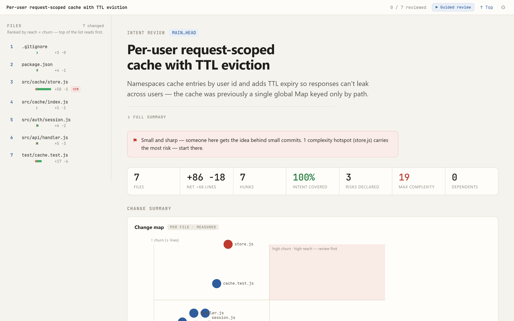
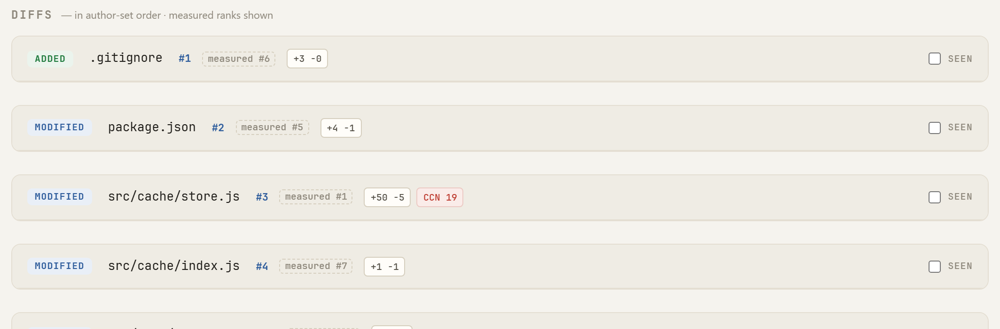
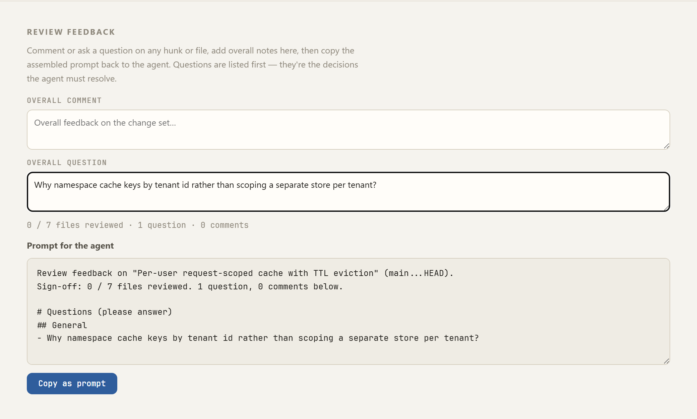
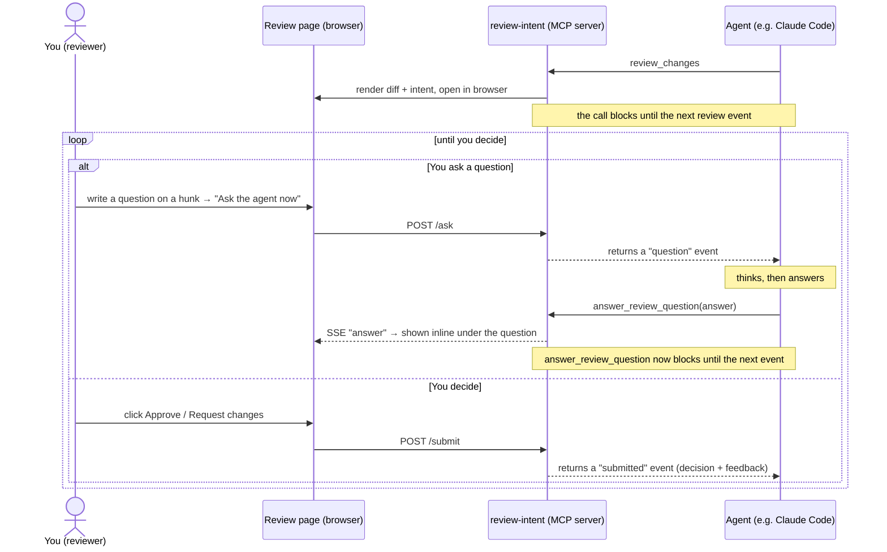

# review-intent

**Turn any PR diff into an intent-annotated review page — the _why_ beside every change, not just the _what_.**

<p align="center">
  
</p>

`review-intent` is a zero-config CLI that renders `git diff <base>...HEAD` as a
self-contained, interactive HTML review page and opens it in your browser. It puts
the change author's **stated intent** side-by-side with each hunk, and pits
**measured** blast-radius metrics against the author's **claimed** risk — so
contradictions surface at a glance.

No LLM call, no API key, no per-run cost. It's a pure renderer.

> **Built for the agent era.** When an AI writes the code, the diff alone can't
> tell you whether the reasoning was sound. `review-intent` makes the reasoning
> reviewable.

---

## Install & run

```sh
# in your repo, on the branch you want to review:
npx @christianmorup/review-intent
```

That's it. It diffs your branch against `main` (or `master`), reads an intent
artifact at `./.review/intent.json`, writes a single self-contained `review.html`,
and opens it. Prefer a global install?

```sh
npm install -g @christianmorup/review-intent
review-intent
```

---

## What you get

### A diff-centric, two-pane review page

The whole change set in one self-contained page: a **file rail** on the left —
every changed file ranked by reach × churn — beside a **main column** that leads
with the title, the author's summary, the measured vitals strip, and the change
map. Pick a file, read its intent, scroll its diff; the rail keeps your place.

<p align="center">
  
</p>

### Claimed vs. measured, side by side

Every page leads with the **measured** surface area — computed from the diff and
un-gameable: a vitals strip (files, ±lines, hunks, intent coverage, max cyclomatic
complexity, downstream dependents) above a one-line **verdict** that sizes the
change set by churn (with a bit of personality), names the complexity hotspots,
and flags when code changed but tests didn't, so you know where to look before
you scroll. The **claimed** side is the author's risk ledger
— _assumption → if false → how you'd know_ — and it sits right beside the measured
change map. When the two disagree, you see it immediately.

<p align="center">
  
  
</p>

### A visual read on where to look

A **change map** plots every changed file by downstream reach × churn, so the
review-first files pick themselves out — it headlines the change-summary band,
right next to the risk ledger. Open **Deeper analysis** (expanded by default) for
the supporting visuals — architecture diagrams, intent-coverage rings, and
measured complexity hotspots — plus the full measured signal list: test-vs-code
lines, debt markers, and sensitive-path badges (`auth`, dependencies, secrets,
pipelines, Dockerfiles…). Every file in the rail carries its own inline diff-mass
sparkline.

<p align="center">
  
</p>

### Architecture diagrams, authored by the change

Class and sequence diagrams (Mermaid) the author writes to show how the pieces fit
and which steps actually changed.

<p align="center">
  
</p>

### A guided review, in the right order

One click walks you file-by-file in review-priority order — highest reach and churn
first — so your attention lands where it matters instead of top-to-bottom.

<p align="center">
  
</p>

### Author-set review order, measurement kept honest

By default files sort by measured reach × churn, but the author can pin a custom
review order — and the override stays auditable: the list runs in the author's
order while every file head still shows where **measurement** ranked it
(`measured #N`). When an author pushes a high-risk file down the list, the
dashed measured badge calls it out instead of hiding it.

<p align="center">
  
</p>

### Comment and question, straight back to the agent

Leave a **comment** (💬) or raise a **question** (❓) on any hunk or file. Both
assemble into a single copy-paste prompt addressed to the agent that made the
change — questions listed first, since they're the decisions the agent must
resolve — so you close the review loop without ever leaving the page.

<p align="center">
  
</p>

### Use it as a tool (MCP)

Skip the copy-paste entirely. `review-intent mcp` starts a Model Context Protocol
stdio server. An agent (e.g. Claude Code) calls its `review_changes` tool; the tool
renders the branch diff (`base...HEAD`) as a review page, opens it in your browser,
and **blocks until you click _Approve_ or _Request changes_** — then returns your
decision plus the assembled feedback straight back to the agent.

While the page is open you can also **ask the agent about a hunk and get its answer
live, inline**, without ending the review. Type a question, click _Ask the agent
now_, and the agent replies through a second tool, `answer_review_question`; the
answer appears under your question and the review stays open until you decide. The
human stays in the loop without ever pasting a prompt. Close the tab without
deciding and the tool returns a no-decision result (detected by a liveness
heartbeat) rather than hanging the agent — an open tab can take as long as you need.

<p align="center">
  
</p>

<p align="center">
  
</p>

The two tools let the agent drive a single conversation: each call blocks until the
next thing you do, so it answers your questions as they come and unblocks for good
only when you decide.



Answers are recorded per question, so if the page reconnects (a sleep or network
blip) the agent's reply is replayed onto it rather than lost; if no tab is connected
when the agent answers, it's told the answer wasn't shown live.

Register it the easy way — from the repo you want reviews in:

```sh
review-intent mcp install      # merges a review-intent entry into ./.mcp.json
review-intent mcp uninstall    # removes just that entry
```

**Recommended setup for agents:** install both the MCP server *and* the
[authoring skill](#honest-intent-enforced) (`review-intent skill install`). The
MCP server is what gives you the **interactive** review — the live Q&A above —
while the skill teaches the agent to author `intent.json` and to **prefer the
`review_changes` tool over the CLI**. With only the skill (no MCP server), the
agent falls back to the CLI, which renders a static page with no live Q&A.

`mcp install` writes/merges the project `.mcp.json`, preserving any other servers
(`--force` overwrites a differing `review-intent` entry). Prefer to wire it by
hand — or register it at user scope in `~/.claude.json`? It's the same entry:

```json
{
  "mcpServers": {
    "review-intent": {
      "command": "review-intent",
      "args": ["mcp"]
    }
  }
}
```

No global install? Use `npx`: `"command": "npx", "args": ["-y", "@christianmorup/review-intent", "mcp"]`.

The tool takes optional `cwd`, `base`, `artifact`, and `allowGaps` arguments and
honors the same completeness gate as the CLI: if intent is incomplete (and
`allowGaps` is false) it returns the gaps as an error instead of opening the
browser. The authoring skill (below) knows about this tool and can offer to drive
the review through it once the intent artifact is written.

The same server also ships the **authoring contract** so the honesty guidance
travels with the tool, even without the skill installed: as a resource
(`review-intent://authoring-guide`) the agent can read, and as a prompt
(`author_intent`, surfaced in Claude Code as `/mcp__review-intent__author_intent`)
the reviewer can invoke to steer the change-making agent.

### Make it yours

Fourteen built-in themes, switched live and remembered between runs — from Paper to
Synthwave.

<p align="center">
  
  
</p>

---

## Honest intent, enforced

The page is only as good as the intent behind it, so the contract has teeth:
`review-intent` **refuses to render** unless every changed file and every hunk
carries a `what` + `why` — no silent blanks.

And it ships a Claude Code skill that teaches the change-making agent to author that
intent _honestly_ — real rejected alternatives, stated assumptions, incidental
changes marked as such — then offer to render the review:

```sh
review-intent skill install          # install the authoring skill for your agent (all repos)
review-intent skill install --force  # overwrite an existing copy — use after upgrading review-intent
review-intent skill uninstall        # remove it
```

After you upgrade `review-intent`, re-run `skill install --force` to refresh the
installed copy with the new guidance — `install` alone won't overwrite an existing
skill file.

A fluent rationalization is worse than nothing: it lowers the reviewer's guard while
adding no signal. The skill pushes for "why I chose this over X," and to admit gaps
rather than invent thoroughness.

---

## License

MIT — see [LICENSE](LICENSE).
