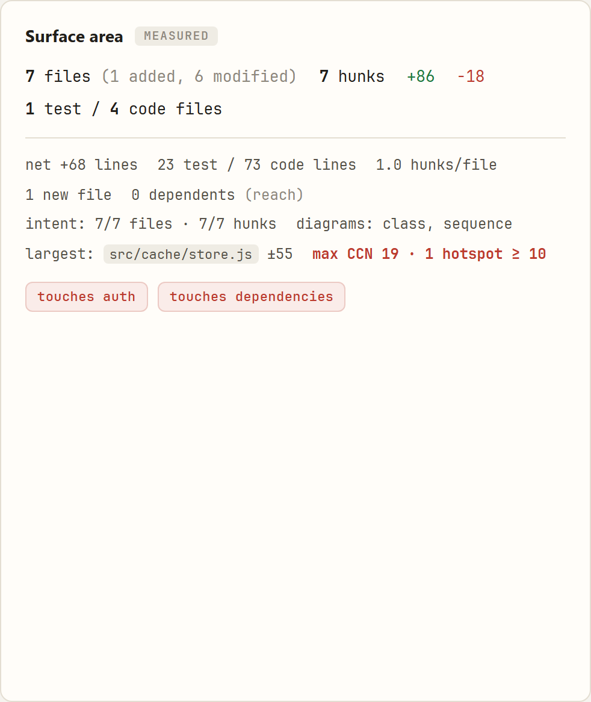
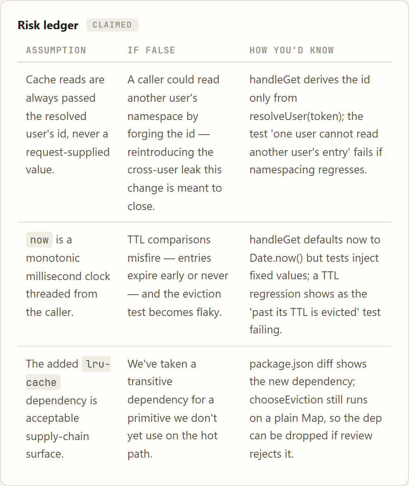
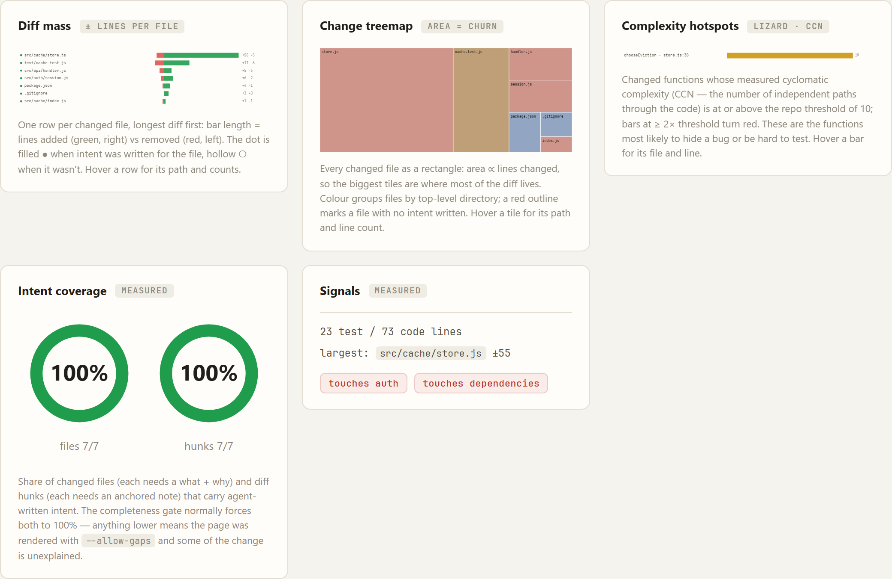
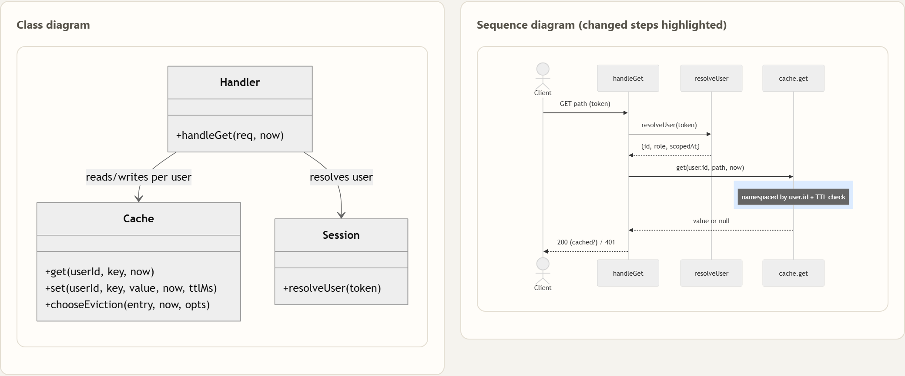
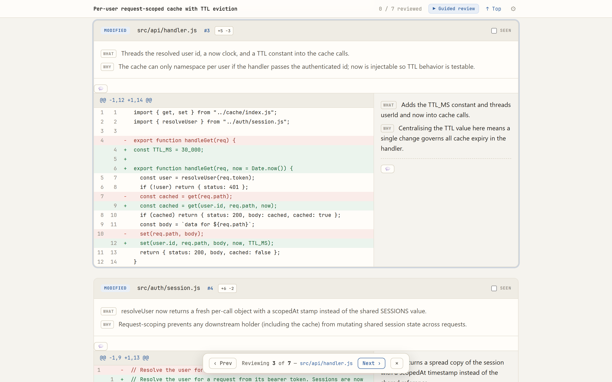
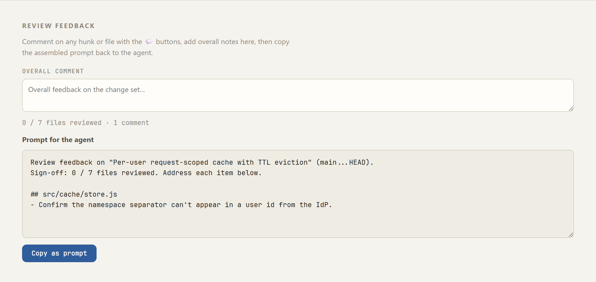
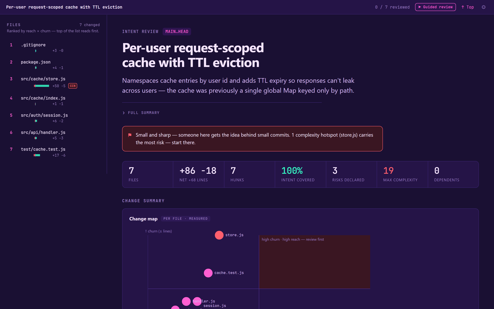
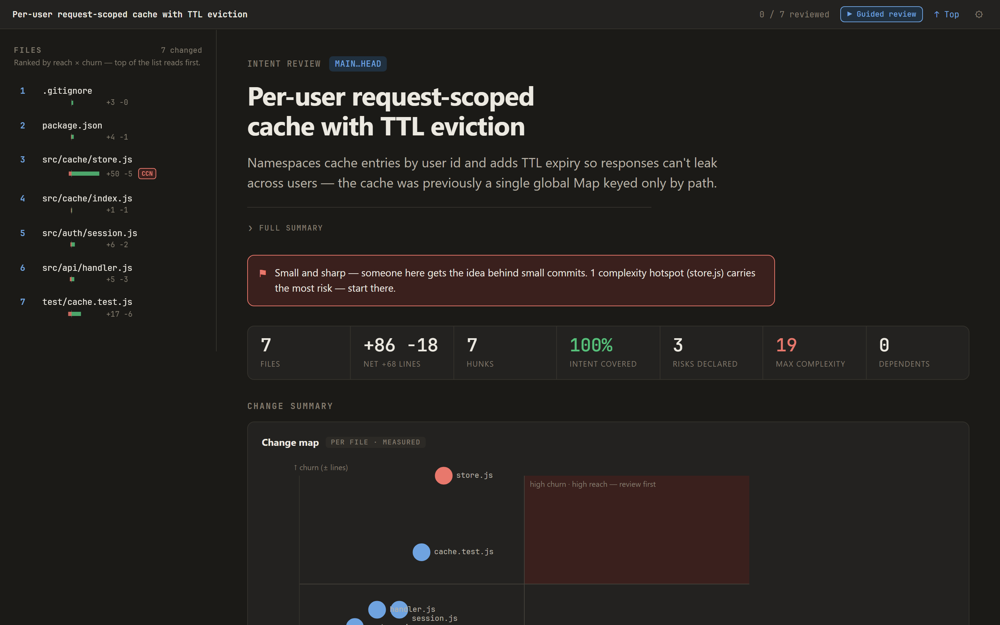

# review-intent

**Turn any PR diff into an intent-annotated review page — the _why_ beside every change, not just the _what_.**

<p align="center">
  
</p>

`review-intent` is a zero-config CLI that renders `git diff <base>...HEAD` as a
self-contained, interactive HTML review page and opens it in your browser. It puts
the change author's **stated intent** side-by-side with each hunk, and pits
**measured** blast-radius metrics against the author's **claimed** risk — so
contradictions surface at a glance.

No LLM call, no API key, no per-run cost. It's a pure renderer.

> **Built for the agent era.** When an AI writes the code, the diff alone can't
> tell you whether the reasoning was sound. `review-intent` makes the reasoning
> reviewable.

---

## Install & run

```sh
# in your repo, on the branch you want to review:
npx @christianmorup/review-intent
```

That's it. It diffs your branch against `main` (or `master`), reads an intent
artifact at `./.review/intent.json`, writes a single self-contained `review.html`,
and opens it. Prefer a global install?

```sh
npm install -g @christianmorup/review-intent
review-intent
```

---

## What you get

### Claimed vs. measured, side by side

Every page opens with a blast-radius block. The **measured** side is computed
from the diff and is un-gameable: files, hunks, ±lines, intent coverage, cyclomatic
complexity, a red flag when code changed but tests didn't, and sensitive-path
badges (`auth`, dependencies, secrets, pipelines, Dockerfiles…). The **claimed**
side is the author's risk ledger — _assumption → if false → how you'd know_. When
the two disagree, you see it immediately.

<p align="center">
  
  
</p>

### A visual summary you can read in five seconds

Five hand-rolled SVG charts — diff mass, a change treemap, intent-coverage rings,
measured complexity hotspots, and a **change map** that plots each file by
downstream reach × churn, so the review-first files pick themselves out.

<p align="center">
  
</p>

### Architecture diagrams, authored by the change

Class and sequence diagrams (Mermaid) the author writes to show how the pieces fit
and which steps actually changed.

<p align="center">
  
</p>

### A guided review, in the right order

One click walks you file-by-file in review-priority order — highest reach and churn
first — so your attention lands where it matters instead of top-to-bottom.

<p align="center">
  
</p>

### Comment and question, straight back to the agent

Leave a **comment** (💬) or raise a **question** (❓) on any hunk or file. Both
assemble into a single copy-paste prompt addressed to the agent that made the
change — questions listed first, since they're the decisions the agent must
resolve — so you close the review loop without ever leaving the page.

<p align="center">
  
</p>

### Use it as a tool (MCP)

Skip the copy-paste entirely. `review-intent mcp` starts a Model Context Protocol
stdio server that exposes one tool, `review_changes`. An agent (e.g. Claude Code)
calls it; the tool renders the branch diff (`base...HEAD`) as a review page, opens it in your browser,
and **blocks until you click _Approve_ or _Request changes_** — then returns your
decision plus the assembled feedback straight back to the agent. The human stays
in the loop without ever pasting a prompt. Close the tab without deciding and the
tool returns a no-decision result (detected by a liveness heartbeat) rather than
hanging the agent — an open tab can take as long as you need.

Register it the easy way — from the repo you want reviews in:

```sh
review-intent mcp install      # merges a review-intent entry into ./.mcp.json
review-intent mcp uninstall    # removes just that entry
```

`mcp install` writes/merges the project `.mcp.json`, preserving any other servers
(`--force` overwrites a differing `review-intent` entry). Prefer to wire it by
hand — or register it at user scope in `~/.claude.json`? It's the same entry:

```json
{
  "mcpServers": {
    "review-intent": {
      "command": "review-intent",
      "args": ["mcp"]
    }
  }
}
```

No global install? Use `npx`: `"command": "npx", "args": ["-y", "@christianmorup/review-intent", "mcp"]`.

The tool takes optional `cwd`, `base`, `artifact`, and `allowGaps` arguments and
honors the same completeness gate as the CLI: if intent is incomplete (and
`allowGaps` is false) it returns the gaps as an error instead of opening the
browser. The authoring skill (below) knows about this tool and can offer to drive
the review through it once the intent artifact is written.

The same server also ships the **authoring contract** so the honesty guidance
travels with the tool, even without the skill installed: as a resource
(`review-intent://authoring-guide`) the agent can read, and as a prompt
(`author_intent`, surfaced in Claude Code as `/mcp__review-intent__author_intent`)
the reviewer can invoke to steer the change-making agent.

### Make it yours

Fourteen built-in themes, switched live and remembered between runs — from Paper to
Synthwave.

<p align="center">
  
  
</p>

---

## Honest intent, enforced

The page is only as good as the intent behind it, so the contract has teeth:
`review-intent` **refuses to render** unless every changed file and every hunk
carries a `what` + `why` — no silent blanks.

And it ships a Claude Code skill that teaches the change-making agent to author that
intent _honestly_ — real rejected alternatives, stated assumptions, incidental
changes marked as such — then offer to render the review:

```sh
review-intent skill install        # install the authoring skill for your agent (all repos)
```

A fluent rationalization is worse than nothing: it lowers the reviewer's guard while
adding no signal. The skill pushes for "why I chose this over X," and to admit gaps
rather than invent thoroughness.

---

## License

MIT — see [LICENSE](LICENSE).
